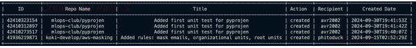
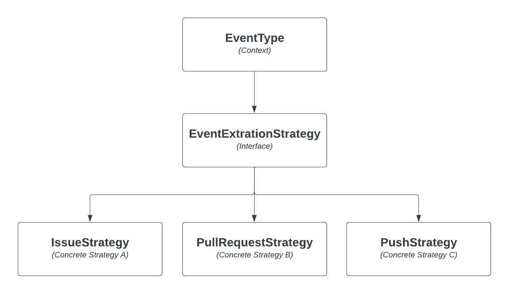

# GitHub User Activity Tracker

## Introduction

This project is a Python-based application that retrieves and analyzes the GitHub activity history of a specified GitHub user. The application interacts with the GitHub API to provide details about various activities, such as commits, pull requests, issues, and reviews. It leverages the **Strategy Design Pattern**, which makes the system flexible, scalable, and easy to maintain.

By using the Strategy pattern, the application delegates event-specific logic to different strategy classes. This makes it simple to add new types of events in the future without modifying the core system, adhering to the **Open/Closed Principle** of object-oriented design.

## Table of Contents

- [Introduction](#introduction)
- [Installation](#installation)
- [Usage](#usage)
- [Features](#features)
- [Event Strategies](#event-strategies)
- [Dependencies](#dependencies)
- [Configuration](#configuration)
- [Documentation](#documentation)
- [Examples](#examples)
- [Troubleshooting](#troubleshooting)
- [Contributors](#contributors)
- [License](#license)

## Installation

### Prerequisites

- Python 3.11 or higher
- GitHub API token

### Steps

1. Clone the repository:

    ```bash
    git clone https://github.com/Morgan-Sell/github-user-activity.git
    cd github-user-activity
    ```

2. Run the initial setup:

    ```
    ./run.sh initial-setup
    ```

    This script will:

   - Check and load environment variables from the .env file.
   - Set up a virtual environment
   - Activate the virtual environment
   - Install dependencies
  
3. Run the application:

    ./run.sh run-app


## Usage

Once you run the application, you can select which GitHub user's activity would you like to see. 

Let's see what [Eric Riddoch](https://github.com/phitoduck), an exceptional MLOps engineer, has been up to.

    ```
    $ Which GitHub user's activity would you like to see? phitoduck

    Pushed 66 times.
    Created 15 repos, branches, or tags.
    Open or closed 2 issues.
    Commented on 3 issues or PRs.
    Opened, closed, or merged 2 PRs.
    Reviewed 4 PRs.
    Commented on 3 PR reviews.
    Forked 1 repos.
    Starred 1 repos.
    ```

The application will then ask if you would like to see details of a specific even type. As of now, there are **5 valid event types** that must be entered in the following format:

- IssueCommentEvent
- IssuesEvent
- PullRequestEvent
- PullRequestReviewEvent
- PushEvent

    ```
    $ Select an event type to see a more detailed history of phitoduck's activity. PullRequestReviewEvent
    ```

The application will generate a table showcasing the details of the selected GitHub event, which in this example is a PR review.




The application will then ask if you would like to view another GitHub user's activity. You can continue to collect GitHub users' activity and request details on accepted event type for a long as you wish.

## Features
- **Fetch GitHub Activity**: Retrieve the activity history for a specified GitHub user, including details like commits, pull requests, and issues.
- **Strategy Design Pattern**: The application dynamically handles different GitHub events using strategies, making the system easily extendable.
- **Supports Multiple Event Types**: Handles events like commits, pull requests, issue comments, and reviews.
- **Extensible and Scalable**: New event types can be added by implementing additional strategies without modifying the core logic.
- **Environment Variable Management**: Uses a `.env` file to securely load sensitive data like GitHub API tokens.


## Event Strategies

This application follows the **Strategy Design Pattern**, where each type of GitHub event is processed by a separate strategy. The `EventType` class (the **Context**) interacts with different strategies, e.g., `IssueCommentStrategy`, to extract the relevant event data.

### Key Components:
- **EventType** (Context): Uses an `EventExtractionStrategy` to process and extract event details.
- **EventExtractionStrategy** (Strategy Interface): Defines methods for extracting event details like the title, user, and action.
- **Concrete Strategies**:
    - **IssueCommentStrategy**: Extracts information from GitHub `IssueCommentEvent`.
    - **IssueStrategy**: Handles details from `IssuesEvent`.
    - **PullRequestStrategy**: Processes `PullRequestEvent` data.
    - **PullRequestReviewStrategy**: Extracts information from `PullRequestReviewEvent`.
    - **PushStrategy**: Handles `PushEvent` data.
  
### Strategy Design Pattern Diagram
The diagram below illustrates how the Strategy Design Pattern is implemented in this application:




## 
Here's the complete README.md incorporating all the details we discussed, including explanations of the Strategy Design Pattern, instructions for adding the image, and details about directory structure best practices:

markdown
Copy code
# GitHub Activity Tracker using Strategy Pattern

## Introduction

This project is a Python-based application that retrieves and analyzes the GitHub activity history of a specified GitHub user. The application interacts with the GitHub API to provide details about various activities, such as commits, pull requests, issues, and reviews. It leverages the **Strategy Design Pattern**, which makes the system flexible, scalable, and easy to maintain.

By using the Strategy pattern, the application delegates event-specific logic to different strategy classes. This makes it simple to add new types of events in the future without modifying the core system, adhering to the **Open/Closed Principle** of object-oriented design.

## Table of Contents

- [Introduction](#introduction)
- [Installation](#installation)
- [Usage](#usage)
- [Features](#features)
- [Event Strategies](#event-strategies)
- [Dependencies](#dependencies)
- [Configuration](#configuration)
- [Documentation](#documentation)
- [Examples](#examples)
- [Troubleshooting](#troubleshooting)
- [Contributors](#contributors)
- [License](#license)

## Installation

### Prerequisites

- Python 3.11 or higher
- GitHub API token

### Steps

1. Clone the repository:

   ```bash
   git clone <repository-url>
   cd <repository-directory>
Run the initial setup:

bash
Copy code
./run.sh initial-setup
This script will:

Check and load environment variables from the .env file.
Set up a virtual environment and install dependencies.
Run the application:

bash
Copy code
./run.sh run-app
The script automatically activates the virtual environment, so there’s no need to do it manually.

Usage
After the application is set up, you can use it to fetch and display the GitHub activity history of a specific user.

To start the app:

bash
Copy code
./run.sh run-app
The application will prompt you for a GitHub username and retrieve details about the user's activities, such as:

Commits
Pull Requests
Issues
Reviews
Features
Fetch GitHub Activity: Retrieve the activity history for a specified GitHub user, including details like commits, pull requests, and issues.
Strategy Design Pattern: The application dynamically handles different GitHub events using strategies, making the system easily extendable.
Supports Multiple Event Types: Handles events like commits, pull requests, issue comments, and reviews.
Extensible and Scalable: New event types can be added by implementing additional strategies without modifying the core logic.
Environment Variable Management: Uses a .env file to securely load sensitive data like GitHub API tokens.
Event Strategies
This application follows the Strategy Design Pattern, where each type of GitHub event is processed by a separate strategy. The EventType class (the Context) interacts with different strategies (e.g., IssueCommentStrategy) to extract relevant event data.

Key Components:
EventType (Context): Uses an EventExtractionStrategy to process and extract event details.
EventExtractionStrategy (Strategy Interface): Defines methods for extracting event details like the title, user, and action.
Concrete Strategies:
IssueCommentStrategy: Extracts information from GitHub IssueCommentEvent.
IssueStrategy: Handles details from IssuesEvent.
PullRequestStrategy: Processes PullRequestEvent data.
PullRequestReviewStrategy: Extracts information from PullRequestReviewEvent.
PushStrategy: Handles PushEvent data.
Strategy Design Pattern Diagram
The diagram below illustrates how the Strategy Design Pattern is implemented in this application:


Dependencies
The application relies on the following Python libraries, which are listed in the requirements.txt file:

- black - Python code formatter.
- isort - Python import sorting tool.
- pytest - Python testing framework.
- ruff - Python linter.
- python-dotenv - Manages environment variables from .env.
- pytest-cov - Test coverage reporting tool for pytest.
- tabulate - Pretty-print tabular data in Python.


Here's the complete README.md incorporating all the details we discussed, including explanations of the Strategy Design Pattern, instructions for adding the image, and details about directory structure best practices:

markdown
Copy code
# GitHub Activity Tracker using Strategy Pattern

## Introduction

This project is a Python-based application that retrieves and analyzes the GitHub activity history of a specified GitHub user. The application interacts with the GitHub API to provide details about various activities, such as commits, pull requests, issues, and reviews. It leverages the **Strategy Design Pattern**, which makes the system flexible, scalable, and easy to maintain.

By using the Strategy pattern, the application delegates event-specific logic to different strategy classes. This makes it simple to add new types of events in the future without modifying the core system, adhering to the **Open/Closed Principle** of object-oriented design.

## Table of Contents

- [Introduction](#introduction)
- [Installation](#installation)
- [Usage](#usage)
- [Features](#features)
- [Event Strategies](#event-strategies)
- [Dependencies](#dependencies)
- [Configuration](#configuration)
- [Documentation](#documentation)
- [Examples](#examples)
- [Troubleshooting](#troubleshooting)
- [Contributors](#contributors)
- [License](#license)

## Installation

### Prerequisites

- Python 3.11 or higher
- GitHub API token

### Steps

1. Clone the repository:

   ```bash
   git clone <repository-url>
   cd <repository-directory>
Run the initial setup:

bash
Copy code
./run.sh initial-setup
This script will:

Check and load environment variables from the .env file.
Set up a virtual environment and install dependencies.
Run the application:

bash
Copy code
./run.sh run-app
The script automatically activates the virtual environment, so there’s no need to do it manually.

Usage
After the application is set up, you can use it to fetch and display the GitHub activity history of a specific user.

To start the app:

bash
Copy code
./run.sh run-app
The application will prompt you for a GitHub username and retrieve details about the user's activities, such as:

Commits
Pull Requests
Issues
Reviews
Features
Fetch GitHub Activity: Retrieve the activity history for a specified GitHub user, including details like commits, pull requests, and issues.
Strategy Design Pattern: The application dynamically handles different GitHub events using strategies, making the system easily extendable.
Supports Multiple Event Types: Handles events like commits, pull requests, issue comments, and reviews.
Extensible and Scalable: New event types can be added by implementing additional strategies without modifying the core logic.
Environment Variable Management: Uses a .env file to securely load sensitive data like GitHub API tokens.
Event Strategies
This application follows the Strategy Design Pattern, where each type of GitHub event is processed by a separate strategy. The EventType class (the Context) interacts with different strategies (e.g., IssueCommentStrategy) to extract relevant event data.

Key Components:
EventType (Context): Uses an EventExtractionStrategy to process and extract event details.
EventExtractionStrategy (Strategy Interface): Defines methods for extracting event details like the title, user, and action.
Concrete Strategies:
IssueCommentStrategy: Extracts information from GitHub IssueCommentEvent.
IssueStrategy: Handles details from IssuesEvent.
PullRequestStrategy: Processes PullRequestEvent data.
PullRequestReviewStrategy: Extracts information from PullRequestReviewEvent.
PushStrategy: Handles PushEvent data.
Strategy Design Pattern Diagram
The diagram below illustrates how the Strategy Design Pattern is implemented in this application:


Dependencies
The application relies on the following Python libraries, which are listed in the requirements.txt file:

black - Python code formatter.
isort - Python import sorting tool.
pytest - Python testing framework.
ruff - Python linter.
python-dotenv - Manages environment variables from .env.
pytest-cov - Test coverage reporting tool for pytest.
tabulate - Pretty-print tabular data in Python.

## Configuration
The application uses a `.env` file to securely manage configuration variables. You need to include your GitHub API token in this file for the application to access the GitHub API. Here's an example `.env` file:

    GITHUB_TOKEN=<your-github-token>

Replace `<your-github-token>` with your actual GitHub token. This token is essential for making authenticated requests to the GitHub API.


Documentation
The project structure is as follows:

```
.
├── .github/               # GitHub-specific configuration (CI, issue templates, etc.)
│   └── workflows/
│       └── cicd.yml       # CICD workflow (e.g., run tests, linting, etc.)
├── img/                   # Images for documentation 
├── src/                   # Application code
│   ├── api.py             # Logic for interacting with the GitHub API
│   ├── config.py          # Configuration settings
│   ├── custom_errors.py   # Custom error classes
│   ├── event_strategy.py  # Strategy classes for GitHub event extraction
│   ├── main.py            # Main entry point of the application
│   ├── operations.py      # Utility functions for event data processing
├── tests/                 # Unit and integration tests
├── README.md              # Project documentation
├── requirements.txt       # Python dependencies
└── run.sh                 # Shell script for setup and execution
